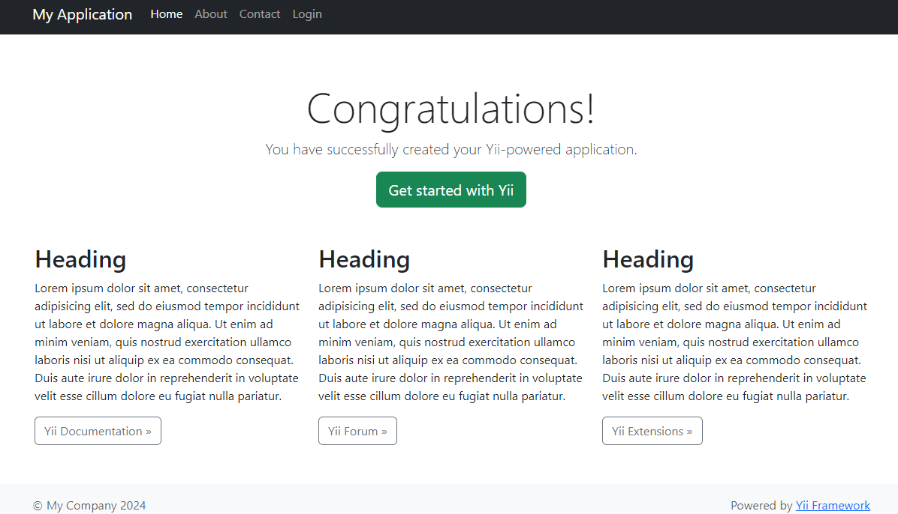

# Yii Stack on Elestio

This is a minimal example of a Yii Stack.

Click on the button below to deploy this repository with CI/CD on Elestio:

<a href="https://dash.elest.io/deploy?source=cicd&social=Github&url=https://github.com/elestio-examples/yii"></a>



<br/>
<br/>

# Steps to clone this repository and run locally

### Step 1: Clone this repository

```
git clone YOUR_REPOSITORY_URL
```

### Step 2: Make some changes and push

Try to make some change in your Yii project that is in `basic` folder, then push to the git repository

After few seconds to few minutes your change will be deployed on your CI/CD target 🚀

# Database Configuration

This repository includes a default MySQL database in the stack, seamlessly connected to your Yii project. However, if you wish to connect to an alternative database, follow the steps below:

## Modifying Database Configuration

To customize your database configuration, follow these steps within your CI/CD project on `elestio`:

1.  Navigate to the Tools tab and click on the `VS Code` button.

2.  In the opened Visual Studio Code environment, locate the `basic > config > db.php` file within your Yii project.

3.  Update the database configuration with your specific credentials. Locate the following section in the file:

        return [
        'class' => 'yii\db\Connection',
        'dsn' => 'mysql:host=your_host;port=your_port;dbname=your_database',
        'username' => 'your_username',
        'password' => 'your_password',
        'charset' => 'utf8',
        ];

4.  Replace the placeholders (`your_host`, `your_port`, `your_database`, `your_username`, and `your_password`) with your specific database details.

Note: If your database is hosted on a specific port, ensure to include the `port` in the dsn parameter.
